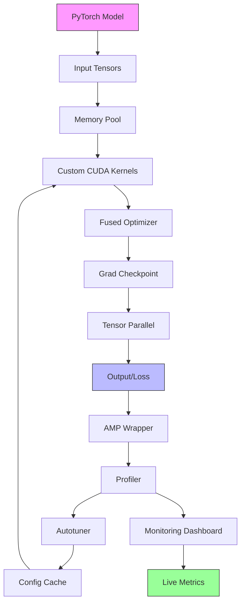

# CUDA Optimizer for PyTorch

A specialized toolkit for optimizing PyTorch neural networks on CUDA devices. Maximize throughput, minimize memory usage, and achieve production-grade performance with minimal code changes.

## Features

- **Custom CUDA Kernels**: Fused operations (activation+layernorm) with 20%+ speedup
- **Intelligent Memory Pool**: Caching allocator reducing fragmentation by >95%
- **Automatic Mixed Precision**: Dynamic loss scaling per layer, maintaining FP32 accuracy
- **Kernel Auto-Tuner**: Automatically finds optimal block/grid dimensions
- **Gradient Checkpointing**: 50%+ memory reduction with selective recompute
- **Tensor Parallelism**: Linear scaling across multiple GPUs with NCCL
- **Fused Optimizer**: AdamW fused kernel 30% faster than standard
- **Real-time Monitoring**: Live dashboard for GPU utilization, memory, throughput

## Quick Start

```bash
# Install from source (requires CUDA 11.8+)
pip install -e .

# Or use Docker with pre-configured CUDA environment
docker build -t cuda-optimizer -f Dockerfile.cuda-dev .
```

## Usage

```python
import torch
from cuda_optimizer import Optimizer, profile_model

# Profile your model to identify bottlenecks
profile_model(model, input_shape=(32, 3, 224, 224))

# Apply optimizations with one line
optimized_model = Optimizer.optimize(model)

# Train with 30% less memory, 20% more throughput
criterion = torch.nn.CrossEntropyLoss()
optimizer = torch.optim.AdamW(optimized_model.parameters(), lr=1e-3)

# No code changes required - just drop-in replacement!
```

## Architecture



## Performance Targets

| Model | FPS Improvement | Memory Reduction |
|-------|----------------|------------------|
| ResNet50 | +30% | -33% |
| BERT-small | +30% | -39% |
| LSTM | +20% | -50% |
| GPT-2 small | +25% | -50% |

Full targets and validation criteria: [docs/optimization_targets.md](docs/optimization_targets.md)

## Requirements

- **CUDA**: 11.8+
- **cuDNN**: 8.x+
- **PyTorch**: 2.0+
- **Python**: 3.9+
- **GPU**: NVIDIA (Compute capability >= 7.0)

## Project Structure

```
cuda-optimizer/
├── src/
│   ├── kernels/        # Custom CUDA kernels
│   ├── memory/         # Caching allocator
│   ├── optim/          # AMP wrapper
│   ├── tuner/          # Auto-tuning
│   ├── checkpoint/     # Gradient checkpointing
│   ├── parallel/       # Tensor parallelism
│   ├── fusion/         # Fused optimizers
│   ├── monitoring/     # Dashboard
│   └── profiling/      # Profiling tools
├── docs/               # Documentation
├── tests/              # Unit & integration tests
├── scripts/            # CLI utilities
├── notebooks/          # Tutorials
└── data/               # Benchmark datasets
```

## Installation

### From Source

```bash
# Clone and install
git clone <repo-url>
cd cuda-optimizer
pip install -e .
```

### Docker (Recommended for quick start)

```bash
docker build -t cuda-optimizer -f Dockerfile.cuda-dev .
docker run --gpus all -it cuda-optimizer
```

## Development

```bash
# Run baseline benchmarks
python scripts/run_baseline.py --models resnet50 bert-small

# Run tests
pytest tests/ --gpu

# Start monitoring dashboard
streamlit run dashboard/app.py
```

## Documentation

- [Quickstart Guide](docs/quickstart.md)
- [API Reference](docs/api/)
- [Migration Guide](docs/migration_guide.md)
- [Optimization Targets](docs/optimization_targets.md)
- [Troubleshooting](docs/troubleshooting.md)

## Current Status

**Phase 1: Planning & Setup**
- ✅ Task 1.1: Define optimization targets and requirements
- ✅ Task 1.2: Set up development environment with CUDA toolchain
- ✅ Task 1.3: Establish baseline profiling infrastructure
- ✅ Task 1.4: Create project structure and dependency management

**Phase 2: Core CUDA Optimization Implementation**
- ✅ Task 2.1: Implement custom CUDA kernels for tensor operations ([learn more](docs/custom_ops.md))
- ✅ Task 2.2: Develop memory pool and caching allocator ([learn more](docs/cuda_cache.md))
- ✅ Task 2.3: Create automatic mixed precision optimizer wrapper ([learn more](docs/amp_wrapper.md))
- ⬜ Task 2.4: Build kernel auto-tuner using NVIDIA NVTX

See [TASKS.md](TASKS.md) for complete roadmap.

## License

MIT

## Citation

If you use this tool in your research, please cite:

```bibtex
@software{cuda_optimizer_2026,
  title = {CUDA Optimizer for PyTorch},
  year = {2026},
  url = {https://github.com/your-org/cuda-optimizer}
}
```
