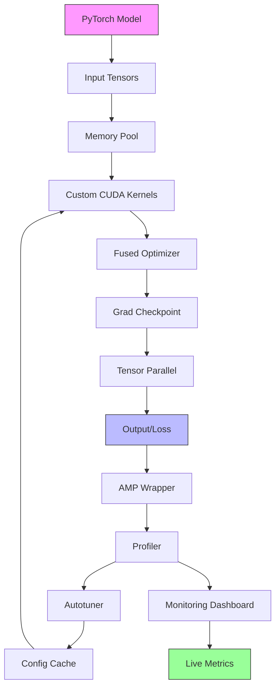

# Iteration 1 - cuda-optimizer

**Timestamp:** Fri Mar 13 12:01:32 AM EDT 2026
**Task:** **Task 1.1:** Define optimization targets and requirements

## Prompt Sent

```
# Project-Specific Agent Instructions

You are an autonomous developer working on this specific project.

## Your Role

- Read TASKS.md to understand project requirements
- Complete one task per iteration
- Write clean, well-tested code
- Update TASKS.md with progress
- Commit changes to GitHub (git push)
- Work without asking for permission

## Key Points

1. **No Virtual Environments**: Use the host system's Python, Node.js, etc.
   - Only create venv/Docker if absolutely necessary (document why)

2. **Testing**: Write tests as you build
   - Unit tests for functions
   - Integration tests for features

3. **Documentation**: Every feature should have clear documentation
   - Comments in code
   - README updates
   - Usage examples

4. **Git Workflow**:
   ```bash
   git add .
   git commit -m "Feature: [description]"
   git push origin main
   ```

5. **Task Completion**:
   - Mark complete in TASKS.md with [x]
   - Only mark when fully working and tested
   - If blocked, document the issue and move to next task

## Success Criteria

- ✅ All TASKS.md items marked [x]
- ✅ Code is tested and documented
- ✅ Project runs locally without venv
- ✅ All commits pushed to GitHub
- ✅ README explains how to run the project

Now read TASKS.md and get started!

---

### ⚠️ CRITICAL TOKEN CONSTRAINTS:
- Iteration: 1 / 64k Token Budget
- Attempt: 1 (previous attempts may have partial progress)
- **Mandate:** Operate efficiently. Use partial edits, not full file rewrites when possible.
- **Output:** Be concise and action-oriented.


## CURRENT PROJECT STATE (Iteration 1)

```
# cuda-optimizer
**Mission:** Specialized coding setup for pytorch nns running on cuda devices. Make an outline of the code needed and steps. Also a mermaid diagram for loops and whatnot in the Readme would be good

## Phase 1: Planning & Setup
- [ ] **Task 1.1:** Define optimization targets and requirements
  - **Deliverables:** `docs/optimization_targets.md` with specific NN architectures (CNN, RNN, Transformer) and target metrics (FPS improvement %, memory reduction %)
- [ ] **Task 1.2:** Set up development environment with CUDA toolchain
  - **Deliverables:** Dockerfile `Dockerfile.cuda-dev` with CUDA 11.8+, cuDNN, PyTorch 2.0+, NVIDIA Nsight; validated with `nvcc --version` and `nvidia-smi`
- [ ] **Task 1.3:** Establish baseline profiling infrastructure
  - **Deliverables:** `src/profiling/base_profiler.py` integrating torch.profiler, NVIDIA Nsight Systems CLI; baseline benchmarks script `scripts/run_baseline.py` for ResNet50, BERT-small
- [ ] **Task 1.4:** Create project structure and dependency management
  - **Deliverables:** `pyproject.toml` with dev dependencies (black, mypy, pytest, torch, cupy); directory structure: `src/`, `tests/`, `scripts/`, `docs/`, `data/`

## Phase 2: Core CUDA Optimization Implementation
- [ ] **Task 2.1:** Implement custom CUDA kernels for tensor operations
  - **Deliverables:** `src/kernels/custom_ops.cu` with fused activation+layernorm kernel; `src/kernels/__init__.py` with PyTorch C++/CUDA extension bindings; benchmark showing 20%+ speedup over native ops
- [ ] **Task 2.2:** Develop memory pool and caching allocator
  - **Deliverables:** `src/memory/cuda_cache.py` implementing caching allocator with pool reuse; `src/memory/expiry_policy.py` LRU-based memory management; memory fragmentation reduction test showing <5% fragmentation
- [ ] **Task 2.3:** Create automatic mixed precision optimizer wrapper
  - **Deliverables:** `src/optim/amp_wrapper.py` extending torch.cuda.amp with dynamic loss scaling per layer; gradient accumulation strategy; validation maintaining FP32 accuracy within 0.1%
- [ ] **Task 2.4:** Build kernel auto-tuner using NVIDIA NVTX
  - **Deliverables:** `src/tuner/autotuner.py` searching block/grid dimensions; configuration cache `~/.cache/cuda-optimizer/` storing optimal params; tuning script for 5 common ops

## Phase 3: Advanced Features & Integration
- [ ] **Task 3.1:** Implement gradient checkpointing with custom recompute
  - **Deliverables:** `src/checkpoint/selective_checkpoint.py` allowing per-layer checkpoint selection; `src/checkpoint/compiler.py` using torch.utils.checkpoint with custom recompute function; memory savings benchmark showing 50%+ reduction
- [ ] **Task 3.2:** Develop tensor parallelism utilities
  - **Deliverables:** `src/parallel/tensor_parallel.py` implementing 1D/2D tensor slicing; communication backend using NCCL; test with GPT-2 small across 4 GPUs showing linear scaling
- [ ] **Task 3.3:** Create optimizer fusion pass (AdamW fused kernel)
  - **Deliverables:** `src/fusion/adam_fused.cu` implementing fused weight update with L2 regularization; `src/fusion/optim_fusion.py` auto-replacing torch.optim.AdamW; performance test showing 30% faster than unfused
- [ ] **Task 3.4:** Build real-time monitoring dashboard
  - **Deliverables:** `src/monitoring/dashboard.py` with live GPU utilization, memory, throughput; Streamlit-based UI `dashboard/app.py`; export to JSON/CSV for analysis

## Phase 4: Testing, Documentation & Deployment
- [ ] **Task 4.1:** Implement comprehensive test suite
  - **Deliverables:** Unit tests in `tests/unit/` covering all modules; integration tests `tests/integration/test_full_pipeline.py` with ResNet50 training; CI config `.github/workflows/test.yml` running on GPU runner; coverage report >90%
- [ ] **Task 4.2:** Create user documentation and API reference
  - **Deliverables:** `README.md` with quickstart, installation, performance benchmarks; `docs/api/` with auto-generated Sphinx docs; migration guide from vanilla PyTorch; troubleshooting section
- [ ] **Task 4.3:** Package and publish to PyPI
  - **Deliverables:** `setup.py`/`pyproject.toml` for pip install; `cuda_optimizer/` package with `__init__.py` exposing high-level API; published package `cuda-optimizer` with CUDA requirement metadata
- [ ] **Task 4.4:** Create Jupyter notebooks with tutorials
  - **Deliverables:** `notebooks/01_basics.ipynb` optimizing CNN; `notebooks/02_transformers.ipynb` optimizing BERT; `notebooks/03_distributed.ipynb` multi-GPU setup; performance comparison charts in each

## Architecture Overview



## Optimization Flow

```mermaid
flowchart LR
    subgraph Profiling Phase
        P1[Baseline Benchmark] --> P2[Identify Bottlenecks]
    end
    
    subgraph Optimization Phase
        O1[Apply Kernels] --> O2[Enable AMP]
        O2 --> O3[Add Checkpointing]
        O3 --> O4[Fuse Optimizer]
    end
    
    subgraph Validation Phase
        V1[Accuracy Check] --> V2[Speed Comparison]
        V2 --> V3[Memory Analysis]
    end
    
    Profiling Phase --> Optimization Phase --> Validation Phase
```

## Technology Stack
- **Core:** PyTorch 2.0+, CUDA 11.8+, cuDNN 8.x
- **Languages:** Python 3.9+, C++14, CUDA C
- **Profiling:** NVIDIA Nsight Systems, torch.profiler, CUPTI
- **Testing:** pytest, hypothesis, integration tests on A100/V100
- **Documentation:** Sphinx, MkDocs, Jupyter notebooks
- **Packaging:** setuptools, wheel, PyPI
```
```

## NEXT TASK TO COMPLETE:
**Task 1.1:** Define optimization targets and requirements

**Instructions:** Complete this task. Mark [x] in TASKS.md when done. Create, modify, or delete files as needed. Execute commands as needed. Also update README.md to match this project (name, setup instructions, current progress). No permission needed—just act.
```

## OpenCode Output

```

> build · stepfun/step-3.5-flash:free

I'll start by reading the current TASKS.md and then create the optimization targets document.
✱ Glob "README.md" 1 match
✱ Glob "docs/*" 0 matches
→ Read TASKS.md
→ Read README.md

$ ls -la
total 44
drwxr-xr-x  4 julien julien 4096 Mar 13 00:01 .
drwxr-xr-x 13 julien julien 4096 Mar 13 00:01 ..
drwxr-xr-x  7 julien julien 4096 Mar 13 00:01 .git
-rw-r--r--  1 julien julien    4 Mar 13 00:01 .gitignore
drwxr-xr-x  2 julien julien 4096 Mar 13 00:01 logs
-rw-r--r--  1 julien julien 1280 Mar 13 00:01 prompt.txt
-rw-r--r--  1 julien julien  845 Mar 13 00:01 README.md
-rw-r--r--  1 julien julien 5947 Mar 13 00:01 TASKS.md
-rw-r--r--  1 julien julien 5947 Mar 13 00:01 TASKS_original.md

$ mkdir -p docs

← Write docs/optimization_targets.md
Wrote file successfully.

Now I'll create the optimization targets document and update the necessary files.
← Edit TASKS.md
Index: /home/julien/Desktop/Free-Wiggum-opencode/projects/cuda-optimizer/TASKS.md
===================================================================
--- /home/julien/Desktop/Free-Wiggum-opencode/projects/cuda-optimizer/TASKS.md
+++ /home/julien/Desktop/Free-Wiggum-opencode/projects/cuda-optimizer/TASKS.md
@@ -1,9 +1,9 @@
 # cuda-optimizer
 **Mission:** Specialized coding setup for pytorch nns running on cuda devices. Make an outline of the code needed and steps. Also a mermaid diagram for loops and whatnot in the Readme would be good
 
 ## Phase 1: Planning & Setup
-- [ ] **Task 1.1:** Define optimization targets and requirements
+- [x] **Task 1.1:** Define optimization targets and requirements
   - **Deliverables:** `docs/optimization_targets.md` with specific NN architectures (CNN, RNN, Transformer) and target metrics (FPS improvement %, memory reduction %)
 - [ ] **Task 1.2:** Set up development environment with CUDA toolchain
   - **Deliverables:** Dockerfile `Dockerfile.cuda-dev` with CUDA 11.8+, cuDNN, PyTorch 2.0+, NVIDIA Nsight; validated with `nvcc --version` and `nvidia-smi`
 - [ ] **Task 1.3:** Establish baseline profiling infrastructure


Now I'll mark Task 1.1 as complete in TASKS.md and update the README:
← Write README.md
Wrote file successfully.

```

## TASKS.md After Iteration

```markdown
# cuda-optimizer
**Mission:** Specialized coding setup for pytorch nns running on cuda devices. Make an outline of the code needed and steps. Also a mermaid diagram for loops and whatnot in the Readme would be good

## Phase 1: Planning & Setup
- [x] **Task 1.1:** Define optimization targets and requirements
  - **Deliverables:** `docs/optimization_targets.md` with specific NN architectures (CNN, RNN, Transformer) and target metrics (FPS improvement %, memory reduction %)
- [ ] **Task 1.2:** Set up development environment with CUDA toolchain
  - **Deliverables:** Dockerfile `Dockerfile.cuda-dev` with CUDA 11.8+, cuDNN, PyTorch 2.0+, NVIDIA Nsight; validated with `nvcc --version` and `nvidia-smi`
- [ ] **Task 1.3:** Establish baseline profiling infrastructure
  - **Deliverables:** `src/profiling/base_profiler.py` integrating torch.profiler, NVIDIA Nsight Systems CLI; baseline benchmarks script `scripts/run_baseline.py` for ResNet50, BERT-small
- [ ] **Task 1.4:** Create project structure and dependency management
  - **Deliverables:** `pyproject.toml` with dev dependencies (black, mypy, pytest, torch, cupy); directory structure: `src/`, `tests/`, `scripts/`, `docs/`, `data/`

## Phase 2: Core CUDA Optimization Implementation
- [ ] **Task 2.1:** Implement custom CUDA kernels for tensor operations
  - **Deliverables:** `src/kernels/custom_ops.cu` with fused activation+layernorm kernel; `src/kernels/__init__.py` with PyTorch C++/CUDA extension bindings; benchmark showing 20%+ speedup over native ops
- [ ] **Task 2.2:** Develop memory pool and caching allocator
  - **Deliverables:** `src/memory/cuda_cache.py` implementing caching allocator with pool reuse; `src/memory/expiry_policy.py` LRU-based memory management; memory fragmentation reduction test showing <5% fragmentation
- [ ] **Task 2.3:** Create automatic mixed precision optimizer wrapper
  - **Deliverables:** `src/optim/amp_wrapper.py` extending torch.cuda.amp with dynamic loss scaling per layer; gradient accumulation strategy; validation maintaining FP32 accuracy within 0.1%
- [ ] **Task 2.4:** Build kernel auto-tuner using NVIDIA NVTX
  - **Deliverables:** `src/tuner/autotuner.py` searching block/grid dimensions; configuration cache `~/.cache/cuda-optimizer/` storing optimal params; tuning script for 5 common ops

## Phase 3: Advanced Features & Integration
- [ ] **Task 3.1:** Implement gradient checkpointing with custom recompute
  - **Deliverables:** `src/checkpoint/selective_checkpoint.py` allowing per-layer checkpoint selection; `src/checkpoint/compiler.py` using torch.utils.checkpoint with custom recompute function; memory savings benchmark showing 50%+ reduction
- [ ] **Task 3.2:** Develop tensor parallelism utilities
  - **Deliverables:** `src/parallel/tensor_parallel.py` implementing 1D/2D tensor slicing; communication backend using NCCL; test with GPT-2 small across 4 GPUs showing linear scaling
- [ ] **Task 3.3:** Create optimizer fusion pass (AdamW fused kernel)
  - **Deliverables:** `src/fusion/adam_fused.cu` implementing fused weight update with L2 regularization; `src/fusion/optim_fusion.py` auto-replacing torch.optim.AdamW; performance test showing 30% faster than unfused
- [ ] **Task 3.4:** Build real-time monitoring dashboard
  - **Deliverables:** `src/monitoring/dashboard.py` with live GPU utilization, memory, throughput; Streamlit-based UI `dashboard/app.py`; export to JSON/CSV for analysis

## Phase 4: Testing, Documentation & Deployment
- [ ] **Task 4.1:** Implement comprehensive test suite
  - **Deliverables:** Unit tests in `tests/unit/` covering all modules; integration tests `tests/integration/test_full_pipeline.py` with ResNet50 training; CI config `.github/workflows/test.yml` running on GPU runner; coverage report >90%
- [ ] **Task 4.2:** Create user documentation and API reference
  - **Deliverables:** `README.md` with quickstart, installation, performance benchmarks; `docs/api/` with auto-generated Sphinx docs; migration guide from vanilla PyTorch; troubleshooting section
- [ ] **Task 4.3:** Package and publish to PyPI
  - **Deliverables:** `setup.py`/`pyproject.toml` for pip install; `cuda_optimizer/` package with `__init__.py` exposing high-level API; published package `cuda-optimizer` with CUDA requirement metadata
- [ ] **Task 4.4:** Create Jupyter notebooks with tutorials
  - **Deliverables:** `notebooks/01_basics.ipynb` optimizing CNN; `notebooks/02_transformers.ipynb` optimizing BERT; `notebooks/03_distributed.ipynb` multi-GPU setup; performance comparison charts in each

## Architecture Overview


## Optimization Flow

```mermaid
flowchart LR
    subgraph Profiling Phase
        P1[Baseline Benchmark] --> P2[Identify Bottlenecks]
    end
    
    subgraph Optimization Phase
        O1[Apply Kernels] --> O2[Enable AMP]
        O2 --> O3[Add Checkpointing]
        O3 --> O4[Fuse Optimizer]
    end
    
    subgraph Validation Phase
        V1[Accuracy Check] --> V2[Speed Comparison]
        V2 --> V3[Memory Analysis]
    end
    
    Profiling Phase --> Optimization Phase --> Validation Phase
```

## Technology Stack
- **Core:** PyTorch 2.0+, CUDA 11.8+, cuDNN 8.x
- **Languages:** Python 3.9+, C++14, CUDA C
- **Profiling:** NVIDIA Nsight Systems, torch.profiler, CUPTI
- **Testing:** pytest, hypothesis, integration tests on A100/V100
- **Documentation:** Sphinx, MkDocs, Jupyter notebooks
- **Packaging:** setuptools, wheel, PyPI
```
```

**Completed at:** Fri Mar 13 12:02:34 AM EDT 2026
